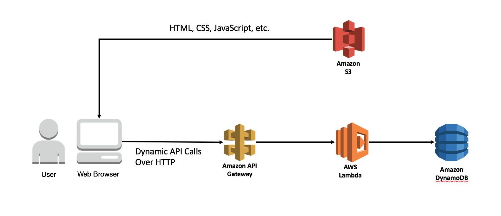

# AWS Serverless Basic Workshop

In this workshop you'll deploy a simple RESTfull webservice that enables users to request **Super Heroes** data from the backend system.

Source: [https://pixabay.com/en/batman-superman-lego-superhero-1293525/](https://pixabay.com/en/batman-superman-lego-superhero-1293525/)
   
   
The application architecture uses [AWS Lambda](https://aws.amazon.com/lambda/), [Amazon API Gateway](https://aws.amazon.com/api-gateway/), and [Amazon DynamoDB](https://aws.amazon.com/dynamodb/). Client will execute a public backend REST API built using API Gateway and Lambda. DynamoDB provides a  persistence layer where data can be stored by the API's Lambda function.

See the diagram below for a depiction of the complete architecture.

## Prerequisites

### AWS Account

In order to complete this workshop you'll need an AWS Account with access to create AWS IAM, S3, DynamoDB, Lambda, API Gateway resources. The code and instructions in this workshop assume only one student is using a given AWS account at a time. If you try sharing an account with another student, you'll run into naming conflicts for certain resources. You can work around these by appending a unique suffix to the resources that fail to create due to conflicts, but the instructions do not provide details on the changes required to make this work.

All of the resources you will launch as part of this workshop are eligible for the AWS free tier if your account is less than 12 months old. See the [AWS Free Tier page](https://aws.amazon.com/free/) for more details.

### Browser

We recommend you use the latest version of Chrome or Firefox when testing the web application UI.

### Text Editor

You will need a local text editor for making minor updates to configuration files.

## Modules

This workshop is broken up into multiple modules. You must complete each module before proceeding to the next.

1. [Persistence Layer - Amazon DynamoDB](01_DynamoDB)
2. [Serverless Backend - AWS Lambda](02_Lambda)
3. [RESTful API - Amazon API Gateway](03_APIGW)
4. [Static Website - Amazon S3](04_S3)

After you have completed the workshop you can delete all of the resources that were created by following the [Cleanup](09_Cleanup) guide.
